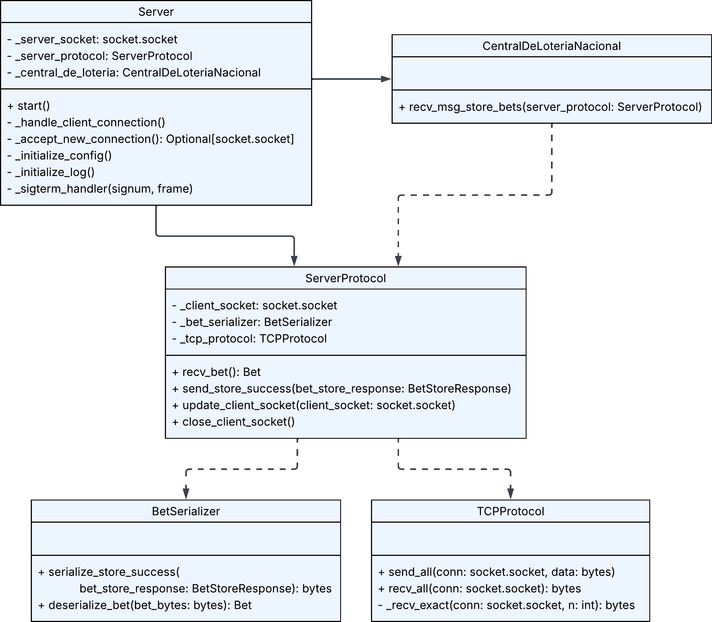
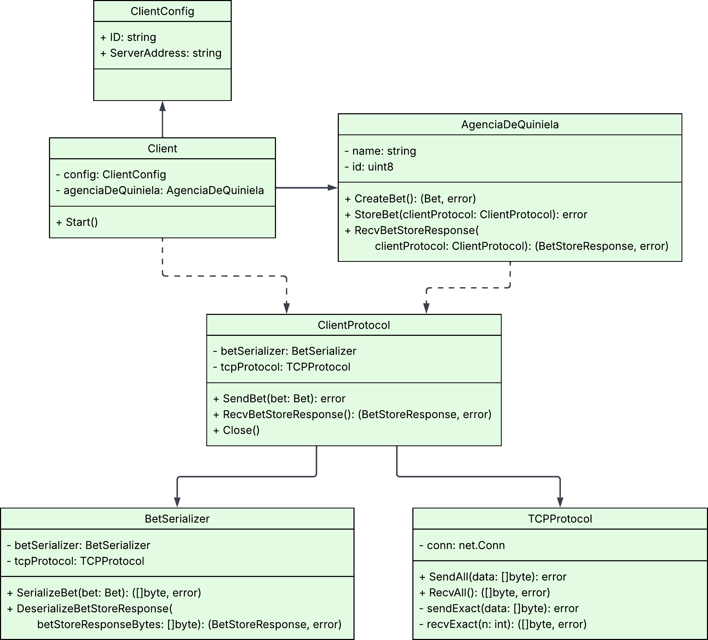
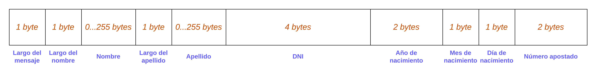

# TP0: Docker + Comunicaciones + Concurrencia

## Parte 1: Introducción a Docker

### Ejercicio N°1:

Este ejercicio consiste en la definición de un script de bash `generar-compose.sh` que permite crear una definición de Docker Compose con una cantidad configurable de clientes.

#### Ejecución:

1. Darle permisos de ejecución al archivo:  
   ```bash
   chmod +x generar-compose.sh
   ```

2. Ejecutar el programa:  
   ```bash
   ./generar-compose.sh <nombre_archivo> <numero_clientes>
   ```

   - `<nombre_archivo>`: Nombre del archivo de salida.
   - `<numero_clientes>`: Número de clientes.

   Ejemplo: 
   ```bash
   ./generar-compose.sh docker-compose-dev.yaml 5
   ```

### Ejercicio N°2:

Para lograr que realizar cambios en los archivos de configuración del cliente y el servidor no requiera reconstruir las imágenes de Docker para que los mismos sean efectivos, se utilizaron volumenes en cada container de tal forma que el archivo de configuración usado sea el mismo al que tiene acceso el Host OS.  
Por ejemplo, para el caso del server:

```yaml
volumes:
  - ./server/config.ini:/config.ini
```

De esta forma tanto el filesystem del container y el Host OS trabajan sobre el mismo archivo.  
A su vez se evitó copiar el archivo de configuración en la imagen. Esto se logró editando el comando `COPY` dentro de los archivos Dockerfile del cliente y el servidor.  
Finalmente, se eliminó la configuración de las variables de entorno de _log levels_ del YAML para permitir que se tomen aquellas definidas en los archivos de configuración. 

### Ejercicio N°3:

Se definió un script de bash `validar-echo-server.sh` para verificar el correcto funcionamiento del servidor utilizando el comando `netcat` para interactuar con el mismo. Dado que el servidor es un echo server, el script manda un mensaje al servidor y espera recibir el mismo mensaje enviado.  
En caso de que la validación sea exitosa se imprime: `action: test_echo_server | result: success`, de lo contrario se imprime: `action: test_echo_server | result: fail`.  
Para evitar la dependencia de instalación de netcat en la máquina host y la exposición del puerto del servidor, se mandaron los mensajes al servidor a través de un container temporal de Docker de la imagen predefinida BusyBox (que incluye comandos como `sh` y `nc`) conectado a la misma red interna creada por Docker Compose: `tp0_testing_net`. 

#### Ejecución:

1. Darle permisos de ejecución al archivo:  
   ```bash
   chmod +x validar-echo-server.sh
   ```

2. Ejecutar el programa:  
   ```bash
   ./validar-echo-server.sh
   ```

### Ejercicio N°4:

Para que el servidor y el cliente terminen de forma graceful al recibir la signal SIGTERM, se modificó el código de ambos servicios para definir un handler que se ejecute cuando esa signal es recibida.  

#### Servidor:  
- El handler cierra los sockets y termina el proceso con código de salida 0.  
- Se configuró un timeout de 0.5 segundos en el socket del servidor para evitar que la llamada a `accept()` quede bloqueada indefinidamente mientras espera nuevas conexiones. Esto permite que el servidor pueda reaccionar al shutdown y finalizar correctamente antes del tiempo límite definido en el `Makefile`, donde al detener los contenedores se espera como máximo un segundo antes de forzar su terminación.

#### Cliente:  
- Se definió un canal de comunicación por el que se recibirá la signal SIGTERM. Al recibirla, se detiene el client loop. 

### Ejercicio N°5:

#### Ejecución:

1. Levantar los containers y ejecutar el programa:  
   ```bash  
   make docker-compose-up
   ```  

2. Ver los logs:  
   ```bash
   make docker-compose-logs
   ```  

3. Detener y eliminar los containers, redes, imagenes y volumenes:  
   ```bash
   make docker-compose-down
   ```

#### Diagrama de Clases:

<p align="center">
  <br>
  <em>Diagrama de clases del server</em>
</p>

<p align="center">
  <br>
  <em>Diagrama de clases del client</em>
</p>

#### Funcionamiento:

- Se levantan 5 clientes, que corresponden a 5 agencias de quiniela, de acuerdo a la configuración definida en el archivo YAML de Docker Compose. Cada cliente tiene definidas sus respectivas variables de entorno que tienen los campos que representan la apuesta de una persona.  
- Los campos se envían al servidor a través de un protocolo TCP con una serialización binaria.
- Para evitar los fenómenos de *short-read* y *short-write*, se recibieron y enviaron los bytes en bucle hasta confirmar que se hubiesen recibido o enviado todos los bytes respectivamente, tanto en client como en server.
- Al recibir el mensaje, el server lo deserializa y registra la apuesta usando la función `store_bets()`, y luego le manda la confirmación de registro al client.  
- Finalmente, al recibir la confirmación el client cierra su conexión y el server permanece esperando por conexiones de nuevos clients.  

#### Protocolo de Comunicación:

Para la comunicación entre el client y el server, se utilizo el protocolo de comunicación TCP con una serialización binaria hecha de la siguiente manera:  

<p align="center">
<br>
<em>Diagrama serialización del mensaje para registrar una apuesta (client → server)</em>
</p>

<p align="center">
<br>
<em>Diagrama serialización del mensaje de respuesta a un registro de apuesta exitoso (server → client)</em>
</p>
