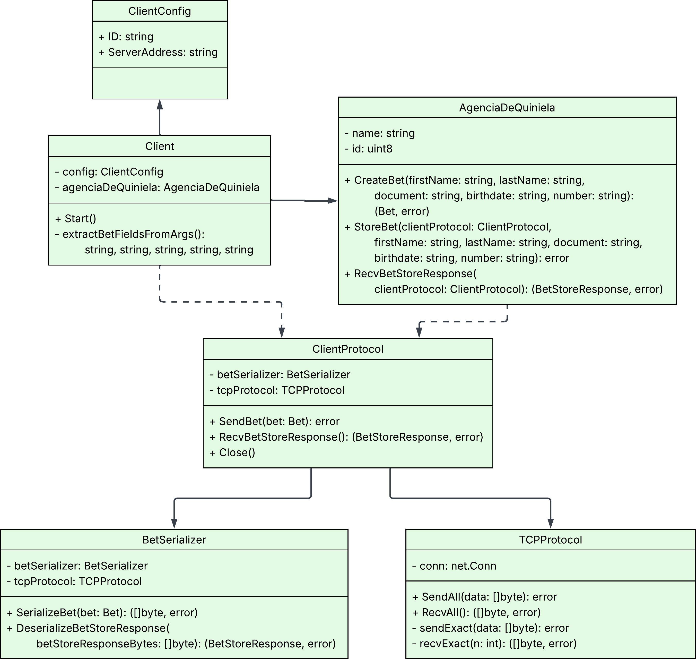
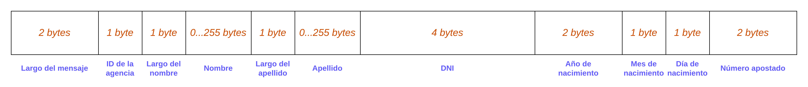
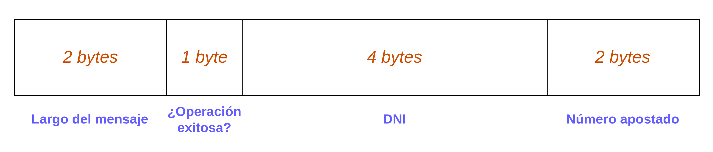
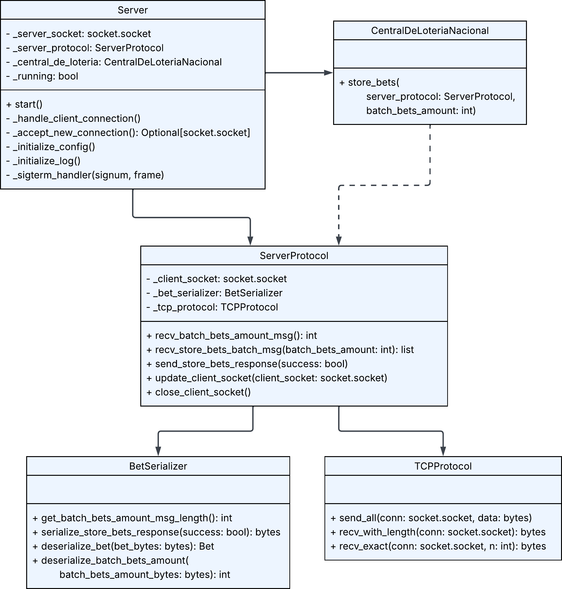
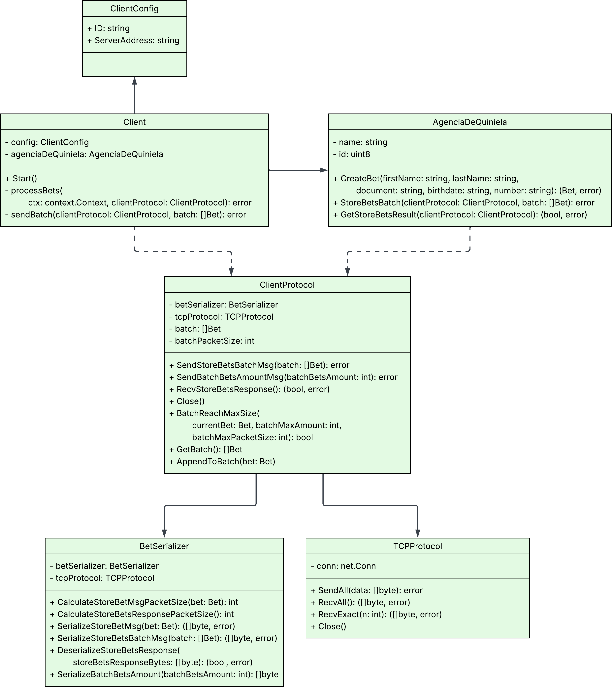

# TP0: Docker + Comunicaciones + Concurrencia

## Índice

- [Parte 1: Introduccion a Docker](#parte-1-introduccion-a-docker)
  - [Ejercicio N°1](#ejercicio-n1)
  - [Ejercicio N°2](#ejercicio-n2)
  - [Ejercicio N°3](#ejercicio-n3)
  - [Ejercicio N°4](#ejercicio-n4)
- [Parte 2: Repaso de Comunicaciones](#parte-2-repaso-de-comunicaciones)
  - [Ejercicio N°5](#ejercicio-n5)
  - [Ejercicio N°6](#ejercicio-n6)

## Parte 1: Introducción a Docker

### Ejercicio N°1:

Este ejercicio consiste en la definición de un script de bash `generar-compose.sh` que permite crear una definición de Docker Compose con una cantidad configurable de clientes.

#### Ejecución:

1. Darle permisos de ejecución al archivo:  
   ```bash
   chmod +x generar-compose.sh
   ```

2. Ejecutar el programa:  
   ```bash
   ./generar-compose.sh <nombre_archivo> <numero_clientes>
   ```

   - `<nombre_archivo>`: Nombre del archivo de salida.
   - `<numero_clientes>`: Número de clientes.

   Ejemplo: 
   ```bash
   ./generar-compose.sh docker-compose-dev.yaml 5
   ```

### Ejercicio N°2:

Para lograr que realizar cambios en los archivos de configuración del cliente y el servidor no requiera reconstruir las imágenes de Docker para que los mismos sean efectivos, se utilizaron volumenes en cada container de tal forma que el archivo de configuración usado sea el mismo al que tiene acceso el Host OS.  
Por ejemplo, para el caso del server:

```yaml
volumes:
  - ./server/config.ini:/config.ini
```

De esta forma tanto el filesystem del container y el Host OS trabajan sobre el mismo archivo.  
A su vez se evitó copiar el archivo de configuración en la imagen. Esto se logró editando el comando `COPY` dentro de los archivos Dockerfile del cliente y el servidor.  
Finalmente, se eliminó la configuración de las variables de entorno de _log levels_ del YAML para permitir que se tomen aquellas definidas en los archivos de configuración. 

### Ejercicio N°3:

Se definió un script de bash `validar-echo-server.sh` para verificar el correcto funcionamiento del servidor utilizando el comando `netcat` para interactuar con el mismo. Dado que el servidor es un echo server, el script manda un mensaje al servidor y espera recibir el mismo mensaje enviado.  
En caso de que la validación sea exitosa se imprime: `action: test_echo_server | result: success`, de lo contrario se imprime: `action: test_echo_server | result: fail`.  
Para evitar la dependencia de instalación de netcat en la máquina host y la exposición del puerto del servidor, se mandaron los mensajes al servidor a través de un container temporal de Docker de la imagen predefinida BusyBox (que incluye comandos como `sh` y `nc`) conectado a la misma red interna creada por Docker Compose: `tp0_testing_net`. 

#### Ejecución:

1. Darle permisos de ejecución al archivo:  
   ```bash
   chmod +x validar-echo-server.sh
   ```

2. Ejecutar el programa:  
   ```bash
   ./validar-echo-server.sh
   ```

### Ejercicio N°4:

Para que el servidor y el cliente terminen de forma graceful al recibir la signal SIGTERM, se modificó el código de ambos servicios para definir un handler que se ejecute cuando esa signal es recibida.  

#### Servidor:  
- El handler cierra los sockets y termina el proceso con código de salida 0.  
- Se configuró un timeout de 0.5 segundos en el socket del servidor para evitar que la llamada a `accept()` quede bloqueada indefinidamente mientras espera nuevas conexiones. Esto permite que el servidor pueda reaccionar al shutdown y finalizar correctamente antes del tiempo límite definido en el `Makefile`, donde al detener los contenedores se espera como máximo un segundo antes de forzar su terminación.

#### Cliente:  
- Se definió un canal de comunicación por el que se recibirá la signal SIGTERM. Al recibirla, se detiene el client loop. 

## Parte 2: Repaso de Comunicaciones

#### Ejecución:

1. Levantar los containers y ejecutar el programa:  
   ```bash  
   make docker-compose-up
   ```  

2. Ver los logs:  
   ```bash
   make docker-compose-logs
   ```  

3. Detener y eliminar los containers, redes, imagenes y volumenes:  
   ```bash
   make docker-compose-down
   ```

### Ejercicio N°5:

#### Diagrama de Clases:

<p align="center">
  <br>
  <em>Diagrama de clases del server</em>
</p>

<p align="center">
  <br>
  <em>Diagrama de clases del client</em>
</p>

#### Funcionamiento:

- Se levantan 5 clientes, que corresponden a 5 agencias de quiniela, de acuerdo a la configuración definida en el archivo YAML de Docker Compose. Cada cliente tiene definidas sus respectivas variables de entorno que tienen los campos que representan la apuesta de una persona.  
- Los campos se envían al servidor a través de un protocolo TCP con una serialización binaria.
- Para evitar los fenómenos de *short-read* y *short-write*, se recibieron y enviaron los bytes en bucle hasta confirmar que se hubiesen recibido o enviado todos los bytes respectivamente, tanto en client como en server.
- Al recibir el mensaje, el server lo deserializa y registra la apuesta usando la función `store_bets()`, y luego le manda la confirmación de registro al client.  
- Finalmente, al recibir la confirmación el client cierra su conexión y el server permanece esperando por conexiones de nuevos clients.  

#### Protocolo de Comunicación:

Para la comunicación entre el client y el server, se utilizo el protocolo de comunicación TCP con una serialización binaria hecha de la siguiente manera:  

<p align="center">
<br>
<em>Diagrama serialización del mensaje para registrar una apuesta (client → server)</em>
</p>

<p align="center">
<br>
<em>Diagrama serialización del mensaje de respuesta a un registro de apuesta exitoso (server → client)</em>
</p>

### Ejercicio N°6:

#### Diagrama de Clases:

<p align="center">
  <br>
  <em>Diagrama de clases del server</em>
</p>

<p align="center">
  <br>
  <em>Diagrama de clases del client</em>
</p>

#### Funcionamiento:

- Por cada cliente, se lee su archivo de datos correspondiente línea por línea, calculando cuánto crecería el tamaño del batch en cada paso si se agregase la nueva apuesta.  
- Si el paquete donde se enviaría el batch creciese más que 8kB, o si la cantidad de apuestas dentro del batch superase el valor pasado por el archivo de configuración, no se le agrega la nueva apuesta al batch y se envía lo que se acumuló hasta el momento. Luego se agrega la apuesta al batch vacío.  
- Luego de enviar el batch, el client espera el resultado del server e imprime un log.  
- Por su parte, el servidor procesa el batch generando un vector de apuestas que luego pasa a la función `store_bets()`.  
- Después de almacenar las apuestas del batch, el server envía la respuesta al client e imprime el log.  
- Al terminar de procesar todos los batches, el cliente envía al servidor un mensaje de "cantidad de apuestas en el batch" igual a 0, para que sepa que terminó y deje de procesar los batches, para así poder aceptar conexiones de nuevos clientes.  

#### Protocolo de Comunicación:

Para la comunicación entre el client y el server, se utilizo el protocolo de comunicación TCP con una serialización binaria hecha de la siguiente manera:  

- Mensaje de la cantidad de apuestas en el batch que se enviará a continuación (client → server):  
   2 bytes representando la cantidad de apuestas dentro del batch.

- Mensaje con el batch (client → server):  
   Apuestas serializadas según el Ejercicio 5 concantenadas en un único mensaje.

- Mensaje de resultado de registro de las apuestas del batch (server → client):  
   1 byte con valor igual a 1 si la operación resultó exitosa.

### Ejercicio N°7:

#### Funcionamiento:

- Se definió una variable de entorno para el container del server denominada `CLIENTES` que guarda la cantidad de clientes del programa.  
- Para que el server pueda guardarse los sockets de los clientes asociados a sus agencias, se los guardó en un diccionario. Para la asociación ID de agencia - socket, se definió un mensaje que el cliente manda al comienzo de la comunicación que contiene únicamente el ID de la agencia.  
- Cuando el cliente termina de enviar todos sus batches, espera a la notificación del server sobre el resultado del sorteo.  
- Cuando el server termina de procesar todos los batches (de lo que se entera porque le llega un mensaje con un `batch_bets_amount = 0`), si ya terminó de procesar todos los clientes, entonces realiza el sorteo.  
- Para llevar a cabo el sorteo, se llama al método `draw_winners` de `CentralDeLoteriaNacional` que usa las funciones `load_bets` y `has_won` para poder almacenar en un atributo los ganadores asociados a cada agencia.  
- Se imprime un log en server, y luego se notifica a cada agencia en particular sus ganadores con el método `notify_winners_to_agencies`.
- Cuando el cliente recibe la notificación, imprime un log y cierra su conexión.

#### Protocolo de Comunicación:

Se mantuvo el mismo protocolo de mensajes que en el ejercicio anterior, agregando unos nuevos:  

- Mensaje del ID de la agencia (client → server):  
   1 byte representando el ID de la agencia.

- Mensaje de notificación de ganadores (server → client):  
   1 byte con la cantidad de ganadores seguido de 4 bytes repetidos tantas veces como ganadores haya, pues cada conjunto de 4 bytes es un número de documento.  

## Parte 3: Repaso de Concurrencia

### Ejercicio N°8:

Se modificó el server para un correcto procesamiento de los mensajes en paralelo mediante el uso de la biblioteca `threading` de Python.

#### Funcionamiento:

- El hilo principal del server acepta conexiones. Cada vez que le llega una nueva conexión, genera un nuevo hilo (hilo por client) para que el client sea atentido.  
- Cada client tiene su propia cola de tareas donde espera a que le llegue la proxima tarea a procesar. Se utilizó la cola `queue.Queue`, ya que es una cola bloqueante *thread-safe*.  
- Las fases de ejecución de tareas del server son las siguientes:  
   1. El server la manda la task a cada hilo por client (a través de la cola) de que reciba todos los batches de apuestas y almacenarlos.  
      El acceso al archivo donde se almacenan las apuestas esta sincronizado mediante un lock (`threading.Lock`).
   2. El server espera a que todos los clients hayan almacenado sus apuestas.    
   3. Una vez almacenadas las apuestas, el server hace el sorteo.  
   4. El server la manda la task a cada hilo por client (a través de la cola) de que notifiquen a sus respectivas agencias sus respectivos ganadores.  

Se decidió hacer uso de una cola de tareas para que el server pueda asignarles tareas a cada hilo del cliente y así sincronizar dos etapas de ejecución: el almacenamiento de las apuestas, y el sorteo. Así se logran paralelizar todas las etapas de ejecución que impliquen recibo y envío de mensajes y, al mismo tiempo, hacemos que al momento del sorteo el server abra el archivo de apuestas (`bets.csv`) una única vez.  
